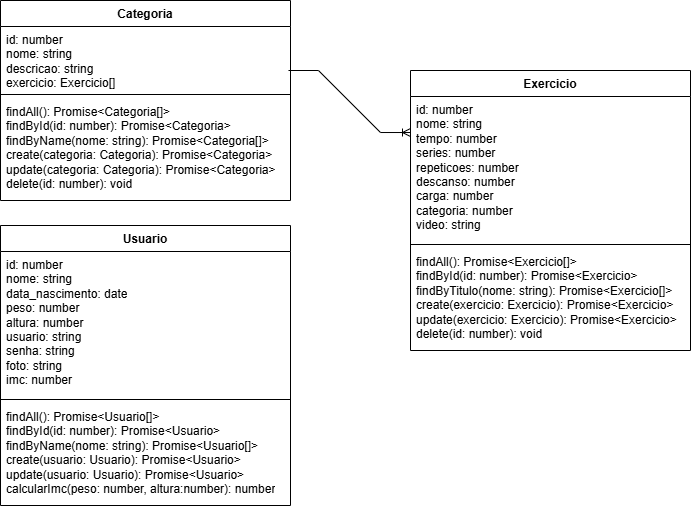
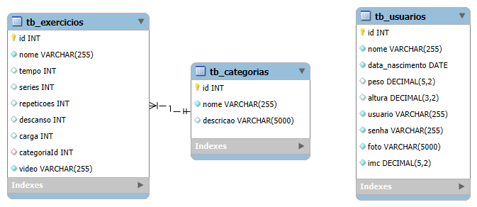

# FitSync – Sincronize seu corpo e sua mente

## 1. Descrição

O projeto consiste em um **Aplicativo de Fitness Personalizado**, desenvolvido em TypeScript e utilizando o NestJS como framework back-end.  
O principal objetivo é fornecer um sistema fitness que permite aos usuários se cadastrarem e acessarem uma variedade de exercícios organizados por categorias. O sistema oferece a possibilidade de encontrar e visualizar exercícios de acordo com as preferências e objetivos do usuário, proporcionando uma experiência personalizada e eficiente.

------

## 2. Sobre esta API

A API **FitSync** foi desenvolvida para fornecer uma plataforma fitness personalizada para gerenciamento e acesso a exercícios. A API permite que usuários criem perfis, visualizem exercícios organizados por categorias e personalizem seus treinos com base em preferências individuais e objetivos específicos.

### 2.1. Principais Funcionalidades

1. **Cadastro de usuários**  
   A API permite que novos usuários sejam registrados no sistema, com informações como:  
   - Nome  
   - Data de nascimento  
   - Peso  
   - Altura  
   - E-mail  
   - Senha  
   - Foto de perfil  

2. **Consulta de exercícios por categorias**  
   A API fornece pontos de acesso para busca e visualização de exercícios, permitindo filtrar por:  
   - Nome  
   - Categoria  

3. **Gerenciamento de exercícios**  
   Os administradores podem criar, atualizar e excluir exercícios com atributos como:  
   - Nome  
   - Tempo de execução  
   - Séries  
   - Repetições  
   - Descanso  
   - Carga  

------

## 3. Diagrama de Classes

------

## 4. Diagrama Entidade-Relacionamento (DER)

------

## 5. Tecnologias utilizadas

| Item                          | Descrição  |
| ----------------------------- | ---------- |
| **Servidor**                  | Node.js    |
| **Linguagem de programação**  | TypeScript |
| **Framework**                 | NestJS     |
| **ORM**                       | TypeORM    |
| **Banco de dados Relacional** | MySQL      |

------

## 6. Configuração e Execução

1. Clone o repositório.  
2. Instale as dependências: `npm install`.  
3. Configure as variáveis de ambiente criando um arquivo `.env`.  
4. Execute a aplicação: `npm run start:dev`.  

---